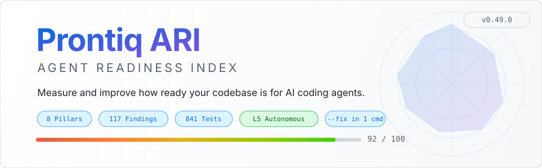
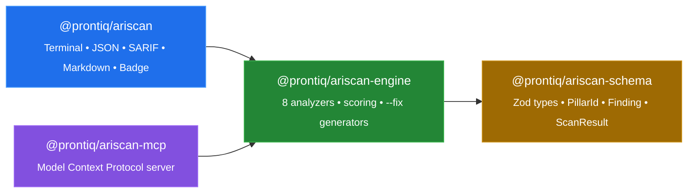

<!-- UPDATE-STATS: When test count, version, finding count, or self-scan score changes,
     update these locations in sync:
     1. shields.io badge URLs (below)
     2. "By the Numbers" HTML table
     3. docs/assets/banner-dark.svg  (feature pills + version pill + score bar)
     4. docs/assets/banner-light.svg (feature pills + version pill + score bar)
-->
<picture>
  <source media="(prefers-color-scheme: dark)" srcset="docs/assets/banner-dark.svg">
  <source media="(prefers-color-scheme: light)" srcset="docs/assets/banner-light.svg">
  
</picture>

<p align="center">
  <a href="https://github.com/jbejenar/prontiq-ariscan/actions/workflows/ci.yml"></a>
  <a href="https://www.npmjs.com/package/@prontiq/ariscan"></a>
  <a href="./LICENSE"></a>
  
  
  
  
</p>

<p align="center">
  <strong>Measure and improve how ready your codebase is for AI coding agents.</strong><br>
  <sub>8 research-calibrated pillars &middot; 117 actionable findings &middot; one-command remediation</sub>
</p>

<p align="center">
  <a href="#quick-start">Quick Start</a>&ensp;&bull;&ensp;
  <a href="#the-ari-score">How Scoring Works</a>&ensp;&bull;&ensp;
  <a href="#scaffold-a-new-repo-to-l3-in-one-command">Auto-Fix</a>&ensp;&bull;&ensp;
  <a href="#architecture">Architecture</a>&ensp;&bull;&ensp;
  <a href="#documentation">Docs</a>
</p>

---

## Quick Start

```bash
npx @prontiq/ariscan .
```

That's it. You'll get a full readiness report with scores, maturity level, and prioritized recommendations.

```
  ARI Score Report
  ────────────────────────────────────────────────────────────

  Score:    72 / 100
  Level:    L4 — Productive
             Multi-file features and refactoring with light supervision

  Profile:  backend-api (high confidence) — 8 findings not applicable

  ────────────────────────────────────────────────────────────
  Pillar Scores

  P1 Agent Context Quality            ████████████████░░░░  85/100  ( 15%)
  P2 Feedback Loop Speed              █████████████░░░░░░░  68/100  ( 15%)
  P3 Test Isolation                   ██████████████░░░░░░  70/100  ( 18%)
  P4 Dev Environment                  ████████████░░░░░░░░  60/100  ( 10%)
  P5 Doc Machine-Readability          ███████████░░░░░░░░░  55/100  ( 10%)
  P6 Build Determinism & Type Safety  ██████████████████░░  90/100  ( 15%)
  P7 Code Navigability                ███████████████░░░░░  75/100  ( 12%)
  P8 Security & Governance            ████████████████░░░░  80/100  (  5%)

  ────────────────────────────────────────────────────────────
  Top Findings (by impact)

  HIGH     [+8.0 pts] ARI-DOC-003 [high] No OpenAPI schema for /api routes
           → Add an openapi.yaml or swagger.json to document your API surface
  MEDIUM   [+5.0 pts] ARI-ENV-002 [medium] No .devcontainer/devcontainer.json
           → Add a dev container config for reproducible environments
  MEDIUM   [+4.0 pts] ARI-NAV-005 [medium] Avg cyclomatic complexity 12 (target: ≤ 8)
           → Extract complex functions into smaller, testable units

  ────────────────────────────────────────────────────────────
  Scanned in 215ms | ariscan v0.57.0 | Rubric v1
  You're reading the abstract. Pass --verbose for the full paper.
```

> **Want the full picture?** Add `--verbose` to see pillar contribution breakdowns, confidence levels, research references, detected languages and frameworks, all context files, and every finding.

### More Output Formats

```bash
npx @prontiq/ariscan . --verbose          # Full analysis: all findings, pillar details, detection info
npx @prontiq/ariscan . --json             # JSON for CI pipelines
npx @prontiq/ariscan . --format sarif     # SARIF for GitHub Code Scanning
npx @prontiq/ariscan . --format markdown  # Markdown report
npx @prontiq/ariscan . --badge badge.svg  # Generate score badge
npx @prontiq/ariscan . --threshold 50     # Exit code 1 if below threshold
npx @prontiq/ariscan . --budget           # Token budget analysis
npx @prontiq/ariscan --json-schema        # Export JSON Schema
```

**Exit codes:** `0` = pass, `1` = below threshold, `2` = runtime error.

---

## The ARI Score

**ARI** (Agent Readiness Index) is a composite score (0-100) derived from 8 weighted pillars:

| | Pillar | Weight | What It Measures |
|:---:|---|:---:|---|
| **P1** | Agent Context Quality | 15% | AGENTS.md quality, information additionality, conciseness |
| **P2** | Feedback Loop Speed | 15% | Local test/lint/typecheck speed, CI duration |
| **P3** | Test Isolation | 18% | Cloud credential independence, DI patterns, determinism |
| **P4** | Dev Environment | 10% | Devcontainer, bootstrap scripts, time-to-first-test |
| **P5** | Doc Machine-Readability | 10% | OpenAPI schemas, error taxonomy, env var validation |
| **P6** | Build Determinism & Type Safety | 15% | TypeScript strict, lockfiles, reproducible builds |
| **P7** | Code Navigability | 12% | Module boundaries, import graph, dead code, complexity |
| **P8** | Security & Governance | 5% | Branch protection, CODEOWNERS, secrets scanning, SAST |

### Maturity Levels

Scores map to five maturity levels that describe what AI agents can realistically achieve:

| | Level | Score | What Agents Can Achieve |
|:---:|---|:---:|---|
|  | Hostile | 0-25 | Agents face significant friction — missing context, absent guardrails, high rework risk |
|  | Fragile | 26-45 | Simple single-file edits feasible with close supervision |
|  | Capable | 46-65 | Routine tasks with moderate supervision |
|  | Productive | 66-80 | Multi-file features and refactoring with light supervision |
|  | Autonomous | 81-100 | Complex cross-service tasks, agent self-verifies |

> **Security gate:** P8 score below 40% caps the overall level at **L2** regardless of other scores.

> Maturity levels are directional indicators informed by [cited research](./docs/research/EVIDENCE-BASE.md), not empirically validated predictions of agent performance. See the [evidence base methodology](./docs/research/EVIDENCE-BASE.md#validation-status--methodology-transparency) for details.

---

## Scaffold a New Repo to L3 in One Command

Running `--fix` generates up to **15 best-practice files** — enough to jump from L2 Fragile (~35) to **L3 Capable (61/100)** in a single pass:

```bash
mkdir my-project && cd my-project
npm init -y
npx @prontiq/ariscan . --fix        # scaffold best practices
npx @prontiq/ariscan .              # verify: 61/100 — L3 Capable
```

All generated files are **additive-only** — existing files are never overwritten. Running `--fix` twice is idempotent.

<details>
<summary><strong>View all 15 generated files</strong></summary>

| File | Pillar | Purpose |
|---|---|---|
| `AGENTS.md` | P1 Context | Agent-specific context with build commands, constraints, TODOs |
| `.agentignore` | P1 Context | Excludes high-token, low-value files from agent context |
| `.devcontainer/devcontainer.json` | P4 Environment | Language-appropriate dev container config |
| `tsconfig.json` | P6 Build | Strict TypeScript config (TS projects only) |
| `.nvmrc` | P4 Environment | Pins Node.js version (Node projects only) |
| `.husky/pre-commit` | P8 Security | Pre-commit hooks for lint + typecheck |
| `.github/CODEOWNERS` | P8 Security | Code ownership template |
| `.github/pull_request_template.md` | P8 Security | PR template with AI-Code Review Checklist |
| `docs/decisions/000-template.md` | P5 Docs | ADR template for architecture decisions |
| `CHANGELOG.md` | P5 Docs | Keep-a-Changelog template |
| `providers/storage.provider.ts` | P3 Isolation | DI-ready storage provider skeleton |
| `.env.example` | P5 Docs | Environment variable documentation (when env vars detected) |
| `docker-compose.yml` | P3 Isolation | Service dependencies (when PostgreSQL/Redis/etc. detected) |
| DI wiring example | P3 Isolation | Framework-specific DI example (NestJS, FastAPI, Spring Boot, Go) |
| `.gitleaks.toml` | P8 Security | Secrets scanning config |

A typical TypeScript project gets 12 files; the remaining 3 are conditional on framework/dependency detection. Review the generated files and customize for your project; the TODO comments indicate where project-specific details should be added.

</details>

---

## Architecture



### Product Layers

1. **Scoring engine** — 8-pillar readiness scoring with maturity tiers.
2. **Remediation engine** — practical fixes for context quality, testability, environment parity, and governance controls.

---

## By the Numbers

<table>
<tr>
<td align="center"><h3>8</h3><sub>Pillars</sub></td>
<td align="center"><h3>117</h3><sub>Finding Codes</sub></td>
<td align="center"><h3>841</h3><sub>Tests</sub></td>
<td align="center"><h3>92/100</h3><sub>Self-Scan Score</sub></td>
<td align="center"><h3>15</h3><sub>Auto-Fix Files</sub></td>
<td align="center"><h3>5</h3><sub>Output Formats</sub></td>
</tr>
</table>

---

## Current Status

The core scanning engine is functional. What's built:

- **@prontiq/ariscan-schema** — Zod schemas for all types (PillarId, MaturityLevel, Finding, PillarResult, ScanResult, ScanConfig, Confidence)
- **@prontiq/ariscan-engine** — All 8 pillar analyzers, composite scoring, security gate, maturity classification, context budget analyzer, `.agentignore` parser, safe `--fix` generators (up to 15 files including AGENTS.md, .agentignore, .devcontainer, tsconfig, .nvmrc, pre-commit hooks, CODEOWNERS, PR template, ADR template, CHANGELOG, docker-compose, .gitleaks.toml, provider skeleton, env var docs, DI wiring examples)
- **@prontiq/ariscan** — Terminal, JSON, SARIF, Markdown output; threshold exit codes; badge generation; JSON Schema export; `--budget` token analysis; `--fix`/`--dry-run` safe file generation
- **841 tests** across 44 test files
- **CI pipeline** — GitHub Actions (lint, typecheck, test, build, self-scan)
- **Test fixtures** — hostile-repo (L1), capable-repo (L3)
- **JSON Schema** — `ariscan.schema.json` in repo root for output validation
- **Dogfooding** — Self-scan: 92/100 (L5 Autonomous)

> **Naming note:** historical research and draft materials may refer to **Tide Conform**. Current naming is **Prontiq ARI**.

---

## Packages

| Package | Status | Purpose |
|---|---|---|
| `@prontiq/ariscan` | Built | CLI scan, scoring, reporting, threshold exit codes |
| `@prontiq/ariscan-schema` | Built | Zod schemas for scan results, config, findings |
| `@prontiq/ariscan-engine` | Built | 8-pillar analyzers, composite scoring, security gate |
| `@prontiq/sdk` | Planned | Programmatic integration for reporting/workflow automation |
| `@prontiq/agentignore` | Built (in engine) | `.agentignore` parser — gitignore-compatible patterns, negation, default patterns |

---

## Current Program Snapshot

| Track | Status | Target |
|---|---|---|
| P1 — MVP CLI | In Progress | May 2026 |
| P2 — Context intelligence | In Progress | Jul 2026 |
| P3 — Readiness-as-Code | Planned | Sep 2026 |

---

<details>
<summary><strong>Versioning Policy</strong></summary>

ARI output follows [Semantic Versioning](https://semver.org/). The JSON schema file (`ariscan.schema.json`) and the `--json-schema` flag document the current output contract.

**Two version signals:** Scan output carries two version identifiers with different semantics:

| Signal | Location | Example | Semantics |
|---|---|---|---|
| **Schema URI** | `$schema` / `$id` field | `.../v1.json` | Schema format revision. Bumps only on breaking structural changes (field removals, type changes). Consumers use this to select the correct parser. |
| **Output version** | `metadata.version` | `0.2.0` | Authoritative semver of the scan output contract. Tracks all changes per the table below. **This is the version consumers should target for feature detection.** |

The schema URI uses major-only versioning (`v1`, `v2`, ...) as a structural stability contract — any consumer built for `v1.json` can parse all output where `metadata.version` is within the `v1` schema generation. The `metadata.version` field is the precise semver that indicates which optional fields, pillars, and finding codes are available.

| Change Type | Semver Impact | Examples |
|---|---|---|
| **Patch** | `x.y.Z` | Bug fixes in scoring, documentation updates, internal refactors — no change to the JSON output surface |
| **Minor** | `x.Y.0` | Any additive change to the JSON output surface: new fields (required or optional), new finding codes, new pillars |
| **Major** | `X.0.0` | Removing or renaming fields, changing field types, changing score semantics, breaking schema changes |

**Backwards compatibility guarantee:** within a major version, all previously valid JSON output fields remain present with the same types and semantics. Consumers can safely parse ARI output without breaking when patch or minor versions are released. A major version bump in `metadata.version` will coincide with a new schema URI (e.g., `v2.json`).

### Deprecation Policy

When a feature, CLI flag, config field, or finding code is scheduled for removal:

1. **Deprecation notice** — the feature is marked deprecated in the next minor release. CLI flags emit a stderr warning; config fields trigger a validation warning via `ariscan policy validate`; finding codes are annotated in the changelog.
2. **Migration window** — deprecated features continue to work for at least **one minor release cycle** after the deprecation notice. Documentation includes migration guidance and the planned removal version.
3. **Removal** — deprecated features are removed in the next major version bump. The changelog and migration guide list all removals.

**Scope:** This policy covers CLI flags and subcommands, JSON output fields, `.ariscan.yml` config schema fields, finding codes (`ARI-*`), and the plugin API (`apiVersion`). Internal engine APIs are not covered — only the public surfaces listed above carry stability guarantees.

### Policy File Migration

The `.ariscan.yml` policy file uses a `version` field to indicate the policy schema version. Current version: `"1"`.

**Migration guidance:**

- **Version `"1"` (current):** Supports composite/per-pillar thresholds, enforcement modes (`warn`/`fail`/`block`), suppressions with reason + expiry, named profiles with weight overrides, and inheritance via `extends`.
- **Path-specific rules:** The `paths` field is defined in the schema but not yet enforced at runtime. Policies containing `paths` rules will fail validation. This will be implemented in a future release.
- **When a new policy version ships:** A migration guide will accompany the release. Run `ariscan policy validate` after upgrading to detect any incompatibilities. The `version` field is optional today — setting it explicitly protects against silent breakage on upgrade.

**Suppression lifecycle:**
- All suppressions require a `reason` (non-empty string) and an `expiry` (YYYY-MM-DD date or `"no-expiry"`).
- Expired suppressions are automatically filtered at scan time and flagged by `ariscan policy validate`.
- Permanent suppressions require explicit `expiry: "no-expiry"`.

</details>

---

## Product Principles

1. **Evidence over opinion** — scoring must remain research-traceable.
2. **Useful by default** — the CLI remains genuinely useful out of the box.
3. **Agent agnosticism** — ARI is independent of any single model vendor.
4. **Operational outcomes first** — readiness scores must drive concrete improvements.
5. **Transparent evolution** — rubric and roadmap updates are explicit and versioned.

---

<details>
<summary><strong>Known Limitations</strong></summary>

- **Structural proxies, not outcome measurement.** ARI measures codebase signals (config presence, code patterns, documentation quality) as readiness proxies. It does not execute agents or measure actual agent performance.
- **No project-scale adaptation (yet).** A 2-file Docker project is currently evaluated against the same criteria as a 500-engineer monorepo. Enterprise-ceremony findings (CODEOWNERS, SECURITY.md, commitlint) may not be applicable to small projects. Planned: [P2.16 Repo Profile & Adaptive Scoring](./roadmap/ROADMAP.md).
- **No insufficient-data handling (yet).** Pillars with no relevant input files (e.g., Code Navigability with no source files) currently return a numeric score rather than marking themselves as unscoreable. Planned: [P2.15 Insufficient Data Handling](./roadmap/ROADMAP.md).
- **Weights are expert-informed, not regression-derived.** Pillar weights reflect research priorities and expert judgment, not a statistical model fit to outcome data. See [EVIDENCE-BASE.md](./docs/research/EVIDENCE-BASE.md).
- **Remediation is template-based.** Fix suggestions are pre-written templates adapted to detected language and framework, not generated per-repo. They may not fit every project's conventions.

</details>

---

## Documentation

| Document | Purpose |
|---|---|
| [roadmap/ROADMAP.md](./roadmap/ROADMAP.md) | Roadmap phases, deliverables, and exit criteria |
| [milestones/MILESTONES.md](./milestones/MILESTONES.md) | Milestone-level acceptance criteria |
| [rfcs/](./rfcs/) | RFC process and architecture/product decisions |
| [docs/research/](./docs/research/) | Evidence base and calibration references |
| [docs/architecture/](./docs/architecture/) | System architecture overview |
| [CHANGELOG.md](./CHANGELOG.md) | Documentation and roadmap revision history |

---

## Contributing

See [roadmap/ROADMAP.md](./roadmap/ROADMAP.md) for the full feature plan. RFCs are in [rfcs/](./rfcs/).

---

## License

Elastic License 2.0 (ELv2) — see [LICENSE](./LICENSE).

Free to use, modify, and redistribute. Cannot be offered as a managed/hosted service or resold.
